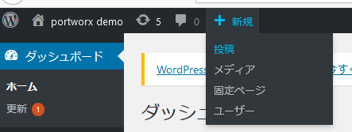
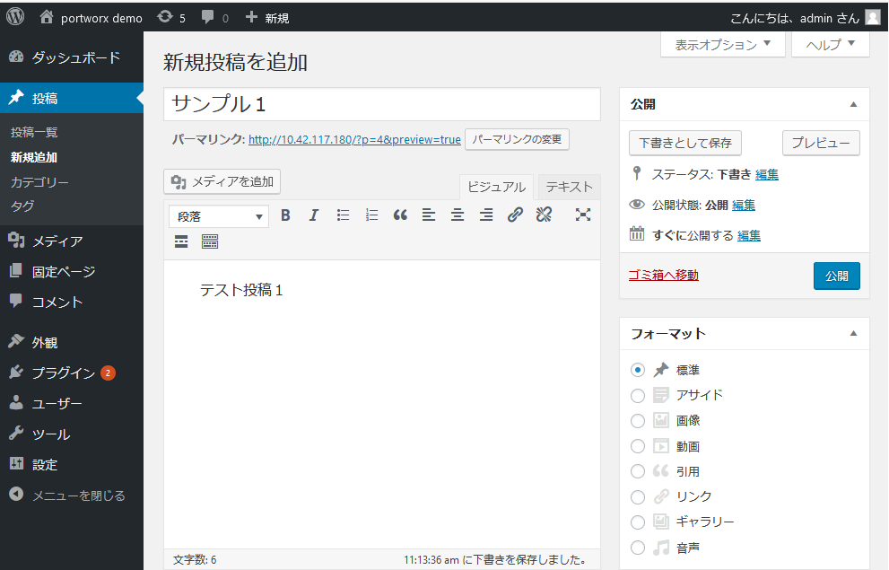
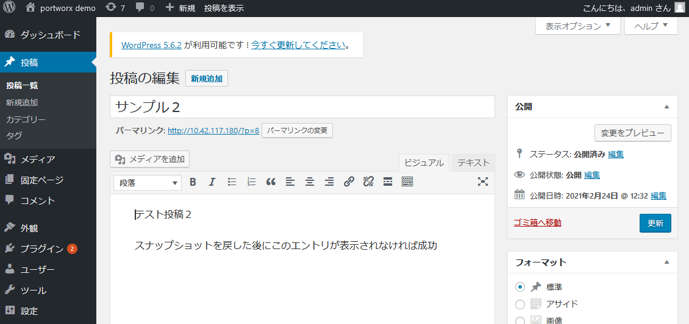
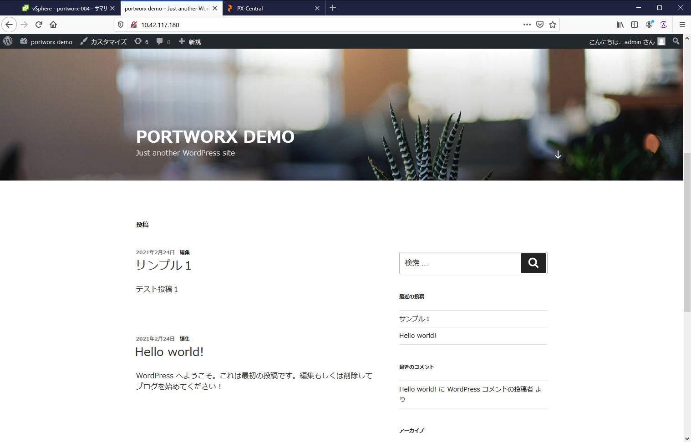
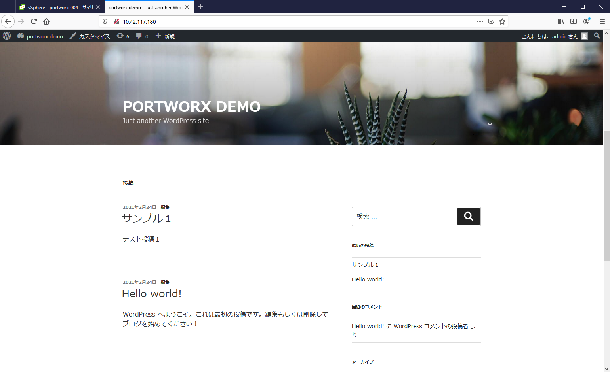

# Wordpress on Portworx demo

Portworxの環境に wordpress 環境をテストデプロイし、WordpressのMySQLデータのスナップショットの取得と、スナップショットのリストアができることを確認します。]

**※このDemoではMetalLBが構成されていることが必須要件になります。**

## デモ手順概要  
1. Wordpressを作成 
   Wordpress+Mysql構成
2. Wordpress初期設定  
3. Wordpressの状態確認   
4. (demo1)スナップショットの作成
   CLIで取得  
5. (demo2)スナップショットのリストア
   利用しているPVに対してリストア  
6. (demo3)Node停止時の挙動について


## Wordpressの作成  
サンプルのマニフェストをデプロイし、リソースが正常に作成されることを確認します。  

`wp-storageclass.yaml` でPortworxのストレージが使えるようにStoregeClassを作成し、その設定を使って、Wordpressで使うストレージを切り出しつつ、Wordpressを実行させます。   

```
kubectl apply -f wp-storageclass.yaml
kubectl apply -f mysql-deployment.yaml
kubectl apply -f wordpress-deployment.yaml
```

- リソースの確認

```
[root@portworx-001 ~]# kubectl get all
NAME                                   READY   STATUS    RESTARTS   AGE
pod/wordpress-567dc99c94-w4vxv         1/1     Running   0          67s
pod/wordpress-mysql-58c566bb64-clp7t   1/1     Running   0          87s

NAME                        TYPE           CLUSTER-IP       EXTERNAL-IP     PORT(S)        AGE
service/kubernetes          ClusterIP      10.96.0.1        <none>          443/TCP        4d20h
service/wordpress-mysql     ClusterIP      None             <none>          3306/TCP       87s
service/wordpress-service   LoadBalancer   10.101.153.175   10.42.117.180   80:30080/TCP   67s

NAME                              READY   UP-TO-DATE   AVAILABLE   AGE
deployment.apps/wordpress         1/1     1            1           67s
deployment.apps/wordpress-mysql   1/1     1            1           87s

NAME                                         DESIRED   CURRENT   READY   AGE
replicaset.apps/wordpress-567dc99c94         1         1         1       67s
replicaset.apps/wordpress-mysql-58c566bb64   1         1         1       87s
```

- Wordpress URL へのアクセス確認   
URLはKubernetesに構成したMetalLBのLoadBalancerで公開されています。  

`service/wordpress-service   LoadBalancer   10.101.153.175   10.42.117.180   80:30080/TCP   67s`
ここの *10.42.117.180* でサービスが公開されています。  


## 初期設定  
URLにアクセスするとサイトのURL作成やAdminのパスワードの設定などが必要になりますので設定を行います。

| 設定名 | 設定値 |  
|:--|:--|
| 言語 | 日本語 |
| サイトのタイトル | portworx demo |
| ユーザー名 | admin | 
| パスワード | admin |
| パスワード確認 | チェックあり |
| メールアドレス | admin@test.local |
| 検索エンジンでの表示 | チェックなし |  

### 記事の作成  
ログイン後にサンプルの記事を作成します。  

- 投稿をクリック  
  

- 投稿内容を記載し、投稿ボタンをクリック  



## 状態確認  
Wordpressが正常に動いていることを確認します。  


## (demo1)スナップショットの作成  
Portworxではストレージスナップショットを作成することができます。  
今回はマニフェストファイルを使って、スナップショットを作成してみます。  

MySQLのストレージスナップショットを作成する、*make_snapshot.yaml* を apply します。
`kubectl apply -f make_snapshot.yaml`  

スナップショットの取得状態を確認します。  
```
[root@portworx-001 ~]# kubectl get volumesnapshot
NAME                      AGE
mysql-pv-claim-snapshot   14s
[root@portworx-001 ~]# kubectl describe volumesnapshot mysql-pv-claim-snapshot
Name:         mysql-pv-claim-snapshot
Namespace:    default
Labels:       SnapshotMetadata-PVName=pvc-df63db97-c390-4314-a49e-98d3e1189abe
              SnapshotMetadata-Timestamp=1614135472015130067
Annotations:  <none>
API Version:  volumesnapshot.external-storage.k8s.io/v1
Kind:         VolumeSnapshot
Metadata:
  Creation Timestamp:  2021-02-24T02:57:51Z
  Generation:          3
  Managed Fields:
    API Version:  volumesnapshot.external-storage.k8s.io/v1
    Fields Type:  FieldsV1
    fieldsV1:
      f:metadata:
        f:annotations:
          .:
          f:kubectl.kubernetes.io/last-applied-configuration:
      f:spec:
        .:
        f:persistentVolumeClaimName:
    Manager:      kubectl-client-side-apply
    Operation:    Update
    Time:         2021-02-24T02:57:51Z
    API Version:  volumesnapshot.external-storage.k8s.io/v1
    Fields Type:  FieldsV1
    fieldsV1:
      f:metadata:
        f:labels:
          .:
          f:SnapshotMetadata-PVName:
          f:SnapshotMetadata-Timestamp:
      f:spec:
        f:snapshotDataName:
      f:status:
        .:
        f:conditions:
        f:creationTimestamp:
    Manager:         Go-http-client
    Operation:       Update
    Time:            2021-02-24T02:57:52Z
  Resource Version:  1687028
  UID:               4321f9eb-034b-40aa-8f03-012adf8bf35e
Spec:
  Persistent Volume Claim Name:  mysql-pv-claim
  Snapshot Data Name:            k8s-volume-snapshot-ba7d99c8-23a7-4739-a558-a77b7c4a94b7
Status:
  Conditions:
    Last Transition Time:  2021-02-24T02:57:53Z
    Message:               Snapshot created successfully and it is ready
    Reason:
    Status:                True
    Type:                  Ready
  Creation Timestamp:      <nil>
Events:                    <none>
```

## (demo2) スナップショットのリストア
スナップショットをリストアするには2つの方法があります。  
1) 新しいPVCにリストア  
2) 既存のPVCにリストア  

今回は 2) を実施します。
稼働しているWordpressに記事を追加投稿後、スナップショットをリストアし元の状態（追加した投稿がない状態）に戻ることを確認してみます。  

### デモの準備  
Wordpressに記事を追加投稿します。  

  
  
  


### デモ  
マウントされている状態だとリストアできないため、一度Podを停止し、リストア後にPodを稼働させます。  

- Podを停止 
`kubectl scale --replicas=0 deployment wordpress-mysql`

- リストア  
`kubectl apply -f restore_snapshot.yaml`

- 状態の確認  
```
[root@portworx-001 portworx-snapshot]# kubectl get volumesnapshotrestore
NAME             AGE
mysql-pv-claim   37s
[root@portworx-001 portworx-snapshot]# kubectl describe volumesnapshotrestore mysql-pv-claim
Name:         mysql-pv-claim
Namespace:    default
Labels:       <none>
Annotations:  <none>
API Version:  stork.libopenstorage.org/v1alpha1
Kind:         VolumeSnapshotRestore
Metadata:
  Creation Timestamp:  2021-02-24T03:40:07Z
  Finalizers:
    stork.libopenstorage.org/finalizer-cleanup
  Generation:  6
  Managed Fields:
    API Version:  stork.libopenstorage.org/v1alpha1
    Fields Type:  FieldsV1
    fieldsV1:
      f:metadata:
        f:annotations:
          .:
          f:kubectl.kubernetes.io/last-applied-configuration:
      f:spec:
        .:
        f:sourceName:
        f:sourceNamespace:
    Manager:      kubectl-client-side-apply
    Operation:    Update
    Time:         2021-02-24T03:40:07Z
    API Version:  stork.libopenstorage.org/v1alpha1
    Fields Type:  FieldsV1
    fieldsV1:
      f:metadata:
        f:finalizers:
      f:spec:
        f:groupSnapshot:
      f:status:
        .:
        f:status:
        f:volumes:
    Manager:         stork
    Operation:       Update
    Time:            2021-02-24T03:40:07Z
  Resource Version:  1699032
  UID:               1221cfce-68d7-4448-bc65-86c3f8fe5697
Spec:
  Group Snapshot:    false
  Source Name:       mysql-pv-claim-snapshot
  Source Namespace:  default
Status:
  Status:  Successful
  Volumes:
    Namespace:  default
    Pvc:        mysql-pv-claim
    Reason:     Restore is successful
    Snapshot:   k8s-volume-snapshot-2d9fdd73-1e50-49c2-a0de-dd462e076626
    Status:     Successful
    Volume:     pvc-df63db97-c390-4314-a49e-98d3e1189abe
Events:
  Type    Reason      Age   From   Message
  ----    ------      ----  ----   -------
  Normal  Successful  31s   stork  Snapshot in-Place  Restore completed
```

- Podの開始  
`kubectl scale --replicas=1 deployment wordpress-mysql`

- WordpressのWebui上で投稿が消えていることを確認  



## (demo3) ノード停止時の挙動デモ  
MySQLのPodが動いているノードを停止し、Podが別のノードにスケジュールされ、元のデータが参照できることを確認します。  

### 環境についての確認  
Portworxのストレージから、PVを払い出すときの設定として *replica (repl)*　があります。  

```
# cat wp-storageclass.yaml
kind: StorageClass
apiVersion: storage.k8s.io/v1
metadata:
   name: portworx-wp-sc1
provisioner: kubernetes.io/portworx-volume
parameters:
  repl: "3"
```  

この設定が3となっている場合、データのレプリカを３つ保持します。  
今回の環境はWorker Node 3台がPortworxクラスターになっています。  
```
# kubectl -n kube-system get storagenodes -l name=portworx
NAME           ID                                     STATUS   VERSION           AGE
portworx-004   7ed7af1f-8281-40ac-a0c2-8500e66cd94f   Online   2.6.3.0-4419aa4   4d19h
portworx-005   f586d535-5b5f-4abf-8a68-41dd7cbd0b63   Online   2.6.3.0-4419aa4   4d19h
portworx-006   7301ca69-8413-4051-97a2-6a9fdc542a02   Online   2.6.3.0-4419aa4   4d19h
```  
  
### デモ  
MysqlのPodが動いているノードを確認します。  

```
# kubectl get po -o wide
NAME                               READY   STATUS    RESTARTS   AGE   IP                NODE           NOMINATED NODE   READINESS GATES
wordpress-567dc99c94-w4vxv         1/1     Running   0          41m   192.168.143.229   portworx-004   <none>           <none>
wordpress-mysql-58c566bb64-clp7t   1/1     Running   0          41m   192.168.143.228   portworx-004   <none>           <none>
```

**portworx-004** のノードを停止します。  
```
# ssh root@portworx-004
root@portworx-004's password:
Last login: Wed Feb 24 10:34:59 2021 from portworx-001.ks-pic.local
[root@portworx-004 ~]# shutdown -h now
Connection to portworx-004 closed by remote host.
Connection to portworx-004 closed.
```

ノードが NotReadyとなっていることを確認します。  
```
# kubectl get node
NAME           STATUS     ROLES                  AGE     VERSION
portworx-001   Ready      control-plane,master   4d20h   v1.20.4
portworx-002   Ready      control-plane,master   4d20h   v1.20.4
portworx-003   Ready      control-plane,master   4d20h   v1.20.4
portworx-004   NotReady   <none>                 4d20h   v1.20.4
portworx-005   Ready      <none>                 4d20h   v1.20.4
portworx-006   Ready      <none>                 4d20h   v1.20.4
```

`watch -n5 kubectl get po -o wide`を実行し、Podが*portworx-004*以外にスケジュールされるのを待ちます。  

```
Every 5.0s: kubectl get po -o wide                                                                                     Wed Feb 24 11:47:41 2021

NAME                               READY   STATUS    RESTARTS   AGE   IP               NODE           NOMINATED NODE   READINESS GATES
wordpress-567dc99c94-9tx68         1/1     Running   0          15s   192.168.84.93    portworx-006   <none>           <none>
wordpress-mysql-58c566bb64-b7ffm   1/1     Running   0          15s   192.168.29.157   portworx-005   <none>           <none>
```

再度、WordpressのURLにアクセスします。 10.42.117.180   
```
# kubectl get svc | grep wordpress-service
wordpress-service   LoadBalancer   10.101.153.175   10.42.117.180   80:30080/TCP   45m
```

テスト投稿した内容が表示されることを確認します。  



