# portworx enterprise install  

Portworx enterpriseのインストールを行います。  
関連のドキュメントや操作対象のWebは下記にあります。  

- インストールドキュメント: https://docs.portworx.com/portworx-install-with-kubernetes/
- 評価版の発行先： https://central.portworx.com/landing/register?utm_medium=website&utm_source=header_button&utm_campaign=Getting%20Started  
  - PX-Central(cloud): https://central.portworx.com/landing/login  

## 前提条件  
- Kubeadmを利用したKubernetesの作成 
- MetalLBをインストールし、Serviceで type:LoadBalancerが利用できること

### Kubernetes のノード構成  
下記のサーバー群を作成、利用してPortworx検証環境として利用。

- Kubernetes node(Master Node/Worker Node)   
 
| | |
|:--|:--|
| 台数 | 3台 |
| CPU | 8Core |
| Memory | 16GB |
| Disk(1) | 120GB |
| Disk(2) | 100GB |

**Disk(2)をPortworkとして利用**

- HAProxy  

| | |
|:--|:--|
| 台数 | 3台 |
| CPU | 4Core |
| Memory | 8GB |
| Disk(1) | 120GB |

### Kubeadm 
Kubernetesを構築するためのツール。  
https://kubernetes.io/ja/docs/setup/production-environment/tools/kubeadm/install-kubeadm/  

今回はマルチノードクラスターとして構成を実施。  

### MetalLB
Kubernetes上に構成可能なベアメタル用のロードバランサー
https://metallb.universe.tf/

PortworxのWebUIをサービス公開する際に簡単に実施できるように構成。


## 事前準備  
今回はOperatorベースでインストールします。  
URL: https://docs.portworx.com/portworx-install-with-kubernetes/on-premise/other/operator/  

URLの手順に従ってOperatorをインストールします。  
`kubectl create -f https://install.portworx.com/?comp=pxoperator`

```
# kubectl create -f https://install.portworx.com/?comp=pxoperator
serviceaccount/portworx-operator created
clusterrole.rbac.authorization.k8s.io/portworx-operator created
clusterrolebinding.rbac.authorization.k8s.io/portworx-operator created
deployment.apps/portworx-operator created
```

## マニフェストの作成  
クラウドのPX-Centralからインストールに必要なマニフェストを作成します。  
PX-Centralにログインし、画面に従って作成を進めます。  
ここでは、細かい設定については振れず、最低限と思われる設定を行います。 

https://central.portworx.com/landing/login

- Portworx Enterpriseを選択し、Next  
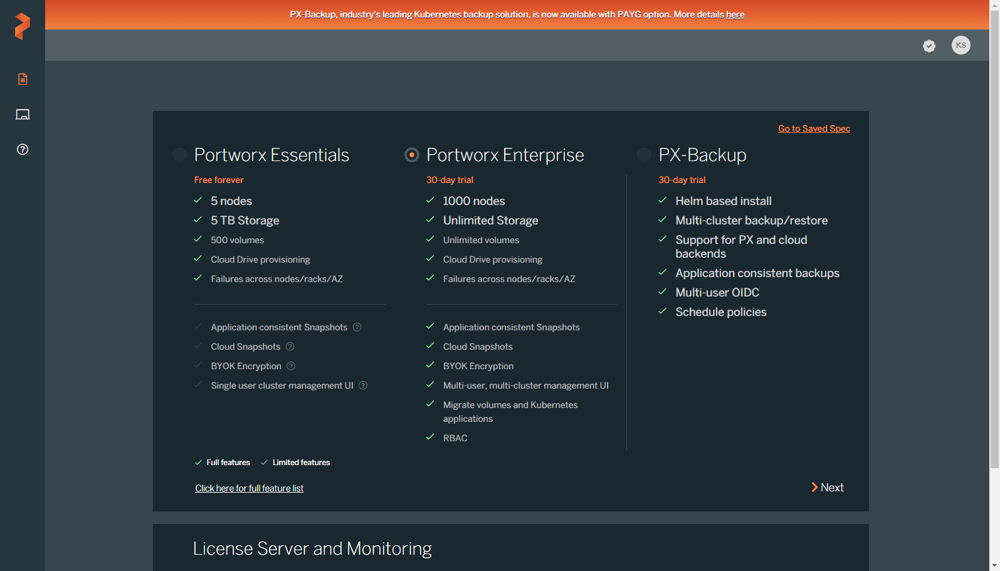  

- 下記設定をしてNext  
  - *use the portworx operator* にチェック 
  - *Portworx version*に2.6がリストされることを確認  
  - *ETCD*で**Built-in** にチェック  
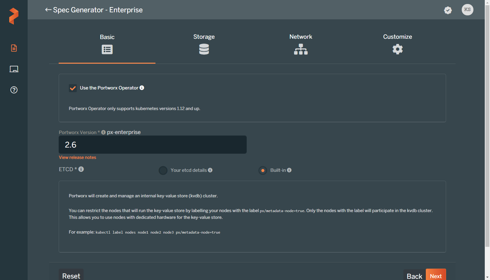

- Storageについて下記設定を行いNext  
  - *Select your environment* にて **On premises**を指定  
  - *Configure KVDB Device* にて **Skip KVDB device** にチェック
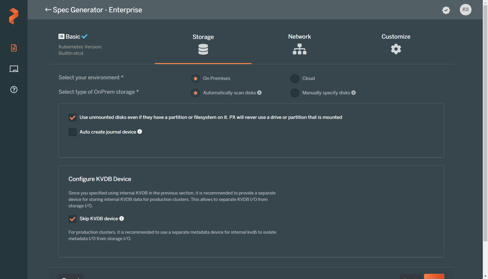  

- Networkは設定を変更せずにNext
  - この場合、PortworxのPortは**9001**
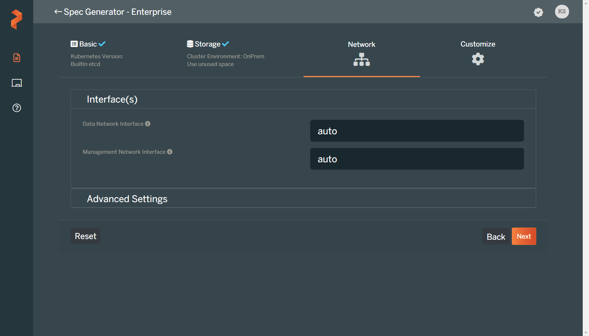  

- Customiseで下記設定を行いFinish 
  - *Customise*で**None**にチェック  
  - Advanced Settings
    - *Enable CSI* にチェック  
    - *Enable Monitoring* にチェック
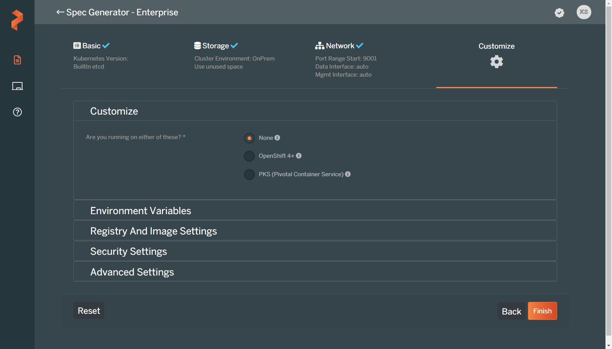  
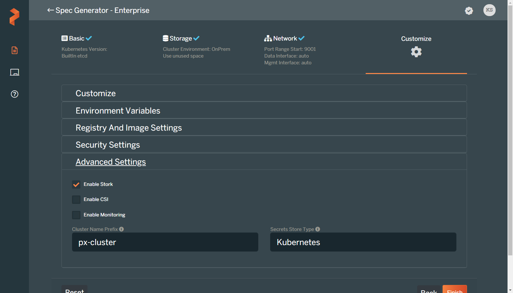

- PORTWORX ENTERPRISE LICENSE AGREEMENTを確認してAgree  
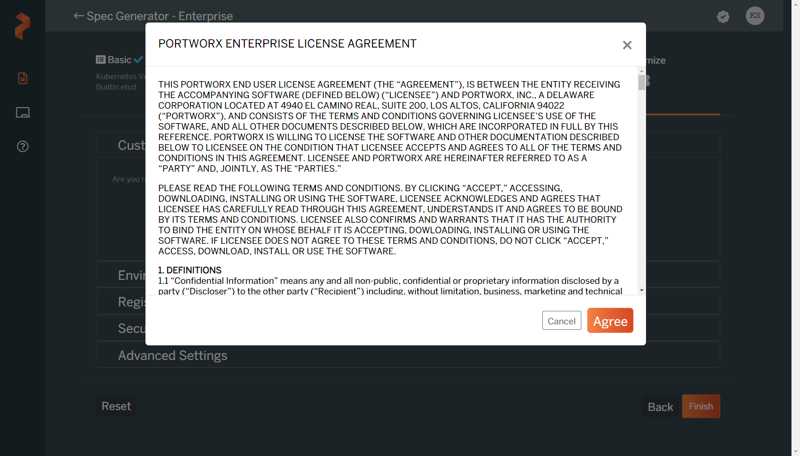


- マニフェストの保存とダウンロードと実行  
Portworx Enterpriseをインストールするためのマニフェストが作成され、ダウンロードできるようになります。  
Spec NameとSpec Labelsを指定して**Download**と **Save Spec** を実行します。  

  - 実行について
    実行方法についてはここでも表示されます。  
    事前準備で実行したOperatorのインストールについても再度表示されます。
    `kubectl create -f https://install.portworx.com/?comp=pxoperator`を実行している場合は不要です。
    Portworxのインストールは2通りあります。
    - Webからマニフェストを取得し実行する方法
    - 作成したマニフェストをWeb上からダウンロードして、自分自身でマニフェストを指定して実行する方法
      
  - 保存したマニフェスト  
    保存したマニフェストはPX-Central上からいつでも確認可能です。  
    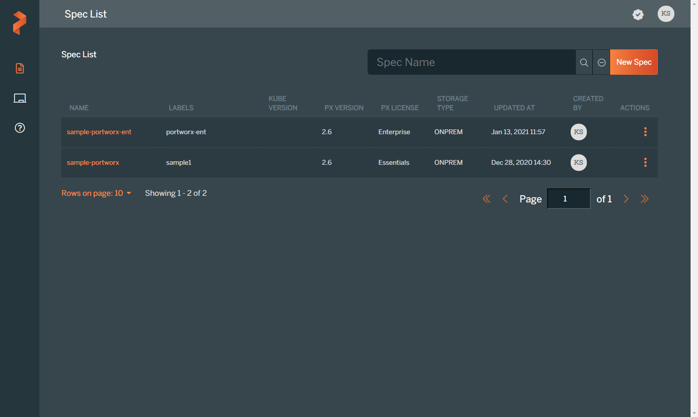

## インストールの実行  
今回はマニフェストの作成で表示されたコマンドをそのまま実行します。
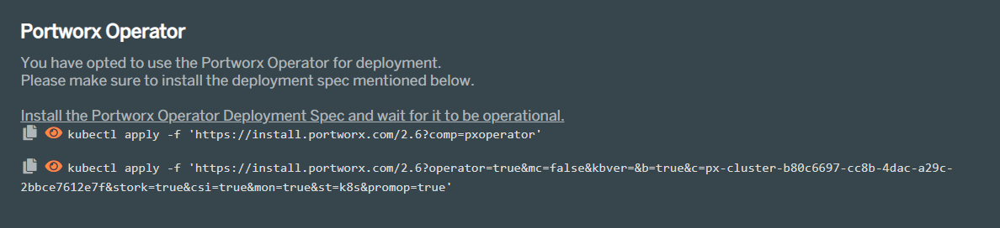

```
kubectl apply -f 'https://install.portworx.com/2.6?comp=pxoperator'
kubectl apply -f 'https://install.portworx.com/2.6?operator=true&mc=false&kbver=&b=true&c=px-cluster-b80c6697-cc8b-4dac-a29c-2bbce7612e7f&stork=true&csi=true&mon=true&st=k8s&promop=true'
```


### 実行後のリソースの確認  
portworxのリソースは Namespace: *kube-system* に作成されます。下記コマンドでPodが正常に稼働しているか確認します。  

`kubectl get pod -n kube-system`  
`kubectl -n kube-system get storagenodes -l name=portworx`  
`kubectl -n kube-system describe storagenode <portworx-node-name>`  


## PX-Backup のインストール  
次にPX-Backupをインストールします。  
Portworx EnterpriseをインストールするだけではGUIは提供されません。  
GUIはPX-Central(LightHouse)として提供されますが、これを利用するためにはPX-Backupのインストールが必須になります。    

Enterpriseのインストールと同様にWeb上のPX-Centralからマニフェストを作成します。  

### 事前準備
#### Helmのインストール    
kubectlを使ってKubernetesを操作する端末上に**Helm**をインストールする必要があります。  

```
curl -fsSL -o get_helm.sh https://raw.githubusercontent.com/helm/helm/master/scripts/get-helm-3
chmod 700 get_helm.sh
./get_helm.sh
```

#### StorageClassの作成  
PX-BackupでもPVを利用するため、Storage Classを事前に作成しておきます。  

```
cat <<EOF >  ./portworx-sc.yaml
kind: StorageClass
apiVersion: storage.k8s.io/v1
metadata:
    name: portworx-sc
provisioner: kubernetes.io/portworx-volume
parameters:
    repl: "3"
EOF
kubectl apply -f portworx-sc.yaml
```

### install  
Web上のPX-Centralにてマニフェストファイルの作成してインストールします。  

- PX-Backupを選択します。  
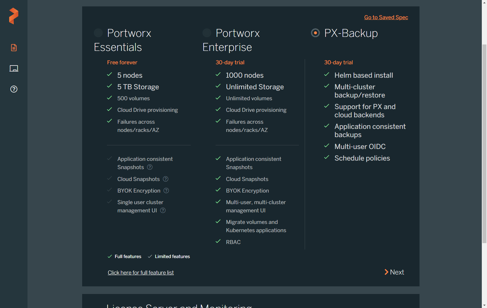  

- 設定を行いNextにすすみます。  
  - *Storage Class name* に先ほど作成したStorage Classを指定します。  **portworx-sc**  
  - その他はデフォルト  
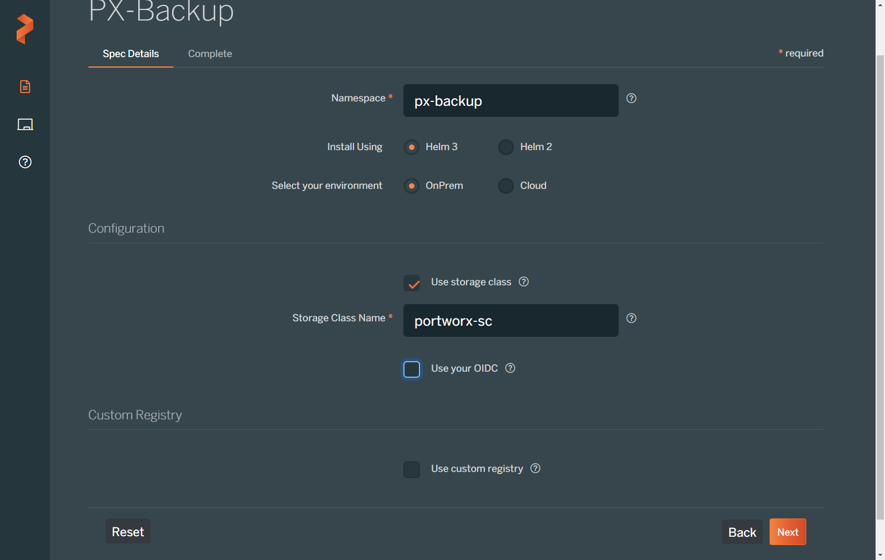  

- PORTWORX BACKUP LICENSE AGREEMENTを確認しAgree  
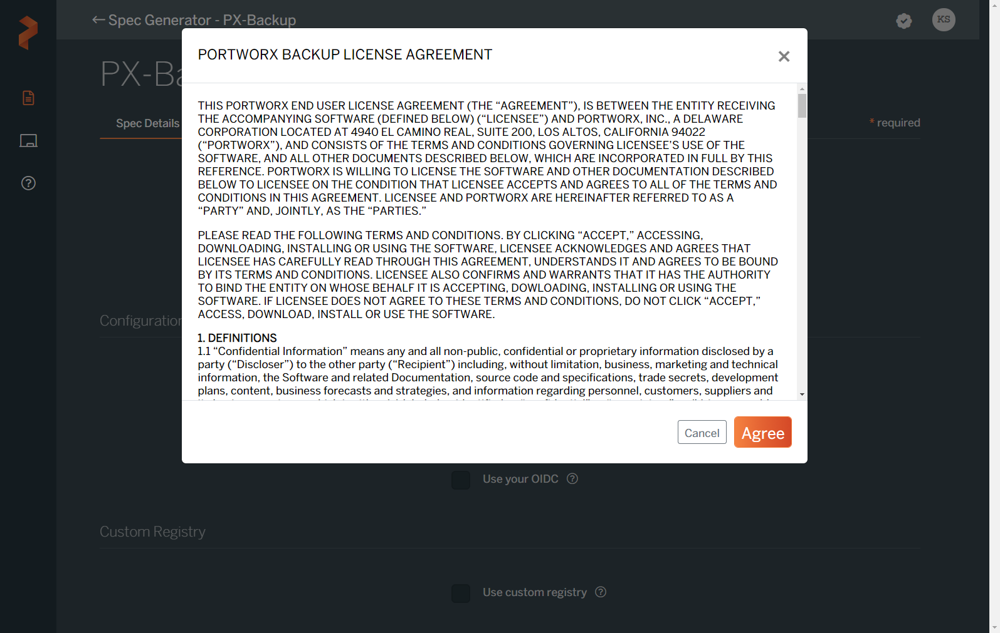  

- 実行手順が表示されるのでkubernetesを操作できる端末から実行する  
```
# Step1
helm repo add portworx http://charts.portworx.io/ && helm repo update

# Step 2
helm install px-backup portworx/px-backup --namespace px-backup --create-namespace --version 1.2.1 --set persistentStorage.enabled=true,persistentStorage.storageClassName="portworx-sc"
```
valueファイルをダウンロードして、自分自身でValueファイルを編集してからhelm installすることも可能。  

- Step2実行後に下記が出力されます。  
```
# helm install px-backup portworx/px-backup --namespace px-backup --create-namespace --version 1.2.1 --set persistentStorage.enabled=true,persistentStorage.storageClassName="portworx-sc"
NAME: px-backup
LAST DEPLOYED: Wed Jan 13 13:57:50 2021
NAMESPACE: px-backup
STATUS: deployed
REVISION: 1
TEST SUITE: None
NOTES:
Your Release is named: "px-backup"
PX-Backup deployed in the namespace: px-backup

--------------------------------------------------
Monitor PX-Backup Install:
--------------------------------------------------
Wait for px-backup status to be in "Completed" state.

    kubectl get po --namespace px-backup -ljob-name=pxcentral-post-install-hook  -o wide | awk '{print $1, $3}' | grep -iv error

--------------------------------------------------
Access PX-Backup UI:
--------------------------------------------------
Using port forwarding:

    kubectl port-forward service/px-backup-ui 8080:80 --namespace px-backup

To access PX-Backup:  http://localhost:8080
Login with the following credentials:

    Username: admin
    Password: admin

For more information: https://github.com/portworx/helm/blob/master/charts/px-backup/README.md

--------------------------------------------------
```  

- PX-Backupのインストール状況を確認します。コマンドは上記の出力内容に記載されています。  
`kubectl get po --namespace px-backup -ljob-name=pxcentral-post-install-hook  -o wide | awk '{print $1, $3}' | grep -iv error`

  - 完了  
    ```
    # kubectl get po --namespace px-backup -ljob-name=pxcentral-post-install-hook  -o wide | awk '{print $1, $3}' | grep -iv error
    NAME STATUS
    pxcentral-post-install-hook-699mx Completed
    ```  

- PX-Backup uiへのアクセス経路について  
今回の環境では、MetalLBが前提条件になりますので、下記のようになっていると思います。
接続するIPは **10.42.117.180** になります。

```
[root@portworx-001 ~]# kubectl get svc px-backup-ui -n px-backup
NAME           TYPE           CLUSTER-IP      EXTERNAL-IP     PORT(S)        AGE
px-backup-ui   LoadBalancer   10.98.181.135   10.42.117.180   80:31763/TCP   8d
```

- WeUIへのアクセス確認    

URL: http://10.42.117.180  
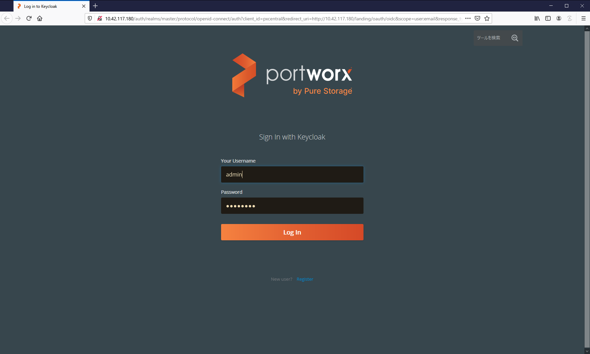  


## monitoring 機能のインストール  
次にMonitoringの機能をインストールします。  
この機能をインストールすることでPortworx Clusterの状況を監視することができるようになります。  
実体としては prometheus と grafana というOSSのツールを利用しています。  

### 事前準備  
このあとに使用するOIDCシークレットを確認します。  
KubectlでKubernetesクラスターに接続する端末上で下記のコマンドを実行し、出力された結果をメモします。

`kubectl get secret --namespace px-backup pxc-backup-secret -o jsonpath={.data.OIDC_CLIENT_SECRET} | base64 --decode`

- sample
```
# kubectl get secret --namespace px-backup pxc-backup-secret -o jsonpath={.data.OIDC_CLIENT_SECRET} | base64 --decode
fc093ed0-c3ff-436a-8a4c-0207038aea76
```

### install  
Web上のPX-Centralにてマニフェストファイルの作成してインストールします。  

- License Server and Monitoring を選択します。  
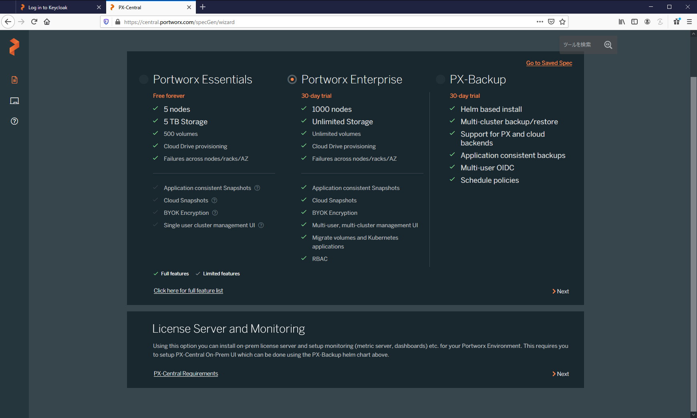  

- - 設定を行いNextにすすみます。  
  - *Storage Class name* に先ほど作成したStorage Classを指定します。  **portworx-sc**  
  - *Monitoring on PX-Central* にチェックをつけます。
  - *PX-Backup UI Endpoint*にWebUIのIPを入力します。
  - *OIDC client secret*に事前準備で確認した値を入力します。
  - その他は変更なし
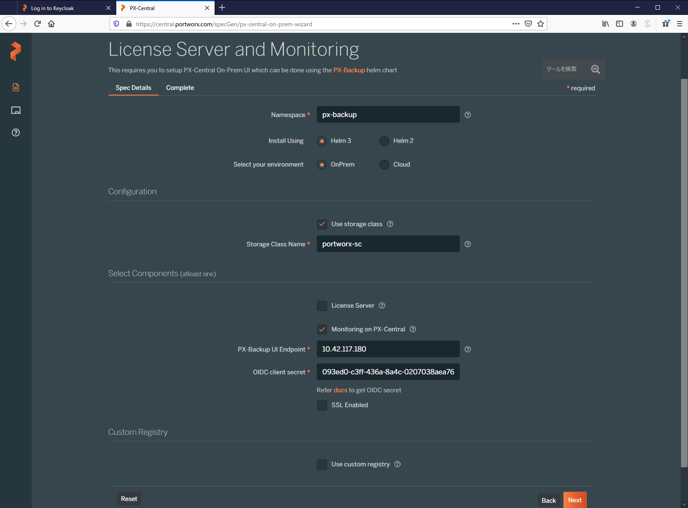  

- PORTWORX BACKUP LICENSE AGREEMENTを確認しAgree  
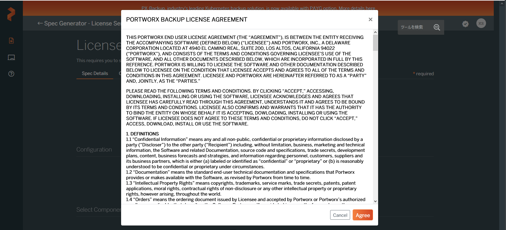  

- 実行手順が表示されるのでkubernetesを操作できる端末から実行する  
```
# Step1
helm repo add portworx http://charts.portworx.io/ && helm repo update

# Step 2
helm install px-monitor portworx/px-monitor --namespace px-backup --create-namespace --version 1.2.1 --set persistentStorage.enabled=true,persistentStorage.storageClassName="portworx-sc",installCRDs=true,pxmonitor.pxCentralEndpoint=10.42.117.180,pxmonitor.oidcClientSecret=fc093ed0-c3ff-436a-8a4c-0207038aea76
```

- Step2の実行後に下記が出力されます。
```
[root@portworx-001 ~]# helm repo add portworx http://charts.portworx.io/ && helm repo update
"portworx" already exists with the same configuration, skipping
Hang tight while we grab the latest from your chart repositories...
...Successfully got an update from the "portworx" chart repository
Update Complete. ?Happy Helming!?
[root@portworx-001 ~]# helm install px-monitor portworx/px-monitor --namespace px-backup --create-namespace --version 1.2.1 --set persistentStorage.enabled=true,persistentStorage.storageClassName="portworx-sc",installCRDs=true,pxmonitor.pxCentralEndpoint=10.42.117.180,pxmonitor.oidcClientSecret=fc093ed0-c3ff-436a-8a4c-0207038aea76
W0305 13:56:58.516630   23294 warnings.go:70] apiextensions.k8s.io/v1beta1 CustomResourceDefinition is deprecated in v1.16+, unavailable in v1.22+; use apiextensions.k8s.io/v1 CustomResourceDefinition
W0305 13:56:58.532261   23294 warnings.go:70] apiextensions.k8s.io/v1beta1 CustomResourceDefinition is deprecated in v1.16+, unavailable in v1.22+; use apiextensions.k8s.io/v1 CustomResourceDefinition
W0305 13:56:58.602081   23294 warnings.go:70] apiextensions.k8s.io/v1beta1 CustomResourceDefinition is deprecated in v1.16+, unavailable in v1.22+; use apiextensions.k8s.io/v1 CustomResourceDefinition
W0305 13:56:58.621282   23294 warnings.go:70] apiextensions.k8s.io/v1beta1 CustomResourceDefinition is deprecated in v1.16+, unavailable in v1.22+; use apiextensions.k8s.io/v1 CustomResourceDefinition
W0305 13:56:58.638503   23294 warnings.go:70] apiextensions.k8s.io/v1beta1 CustomResourceDefinition is deprecated in v1.16+, unavailable in v1.22+; use apiextensions.k8s.io/v1 CustomResourceDefinition
NAME: px-monitor
LAST DEPLOYED: Fri Mar  5 13:56:58 2021
NAMESPACE: px-backup
STATUS: deployed
REVISION: 1
TEST SUITE: None
NOTES:
Your Release is named: "px-monitor"
PX-Monitor deployed in the namespace: px-backup

--------------------------------------------------
Monitor PX-Monitor Install:
--------------------------------------------------
Wait for px-monitor status to be in "Completed" state.

    kubectl get po --namespace px-backup -ljob-name=pxcentral-monitor-post-install-setup  -o wide | awk '{print $1, $3}' | grep -iv error

For more information: https://github.com/portworx/helm/blob/master/charts/px-monitor/README.md

--------------------------------------------------
```

`kubectl get po --namespace px-backup -ljob-name=pxcentral-monitor-post-install-setup  -o wide | awk '{print $1, $3}' | grep -iv error`を実行し、ステータスがCompletedとなることを確認します。


## 管理対象の登録  
PX-Central(オンプレミス)とPX-Backupに管理対象としてPortworx ClusterとKubernetes Clusterを登録します。  

### PX-Central(オンプレミス)にPortworx Clusterを登録  

- WebUIにログインし、 **Lighthouse** に移動し、**Add new** を選択します。
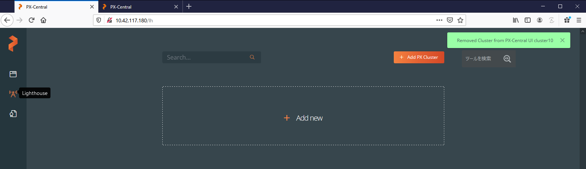  

- パラメータを埋めて *Submit*します。  
  - *Cluster name*に名前を指定します。
  - *Cluster endpoint*にPortworx ClusterになっているノードのIPを指定します。  
    - ここではWorker Node 3台がPortworx Clusterになっていて、そのうちの1台のIPを指定しています。  
  - *Kubeconfig* にConfigの情報を入力します。
    - Configは設定の上段にある `kubectl config view --flatten --minify` を実行することで確認できます。  
  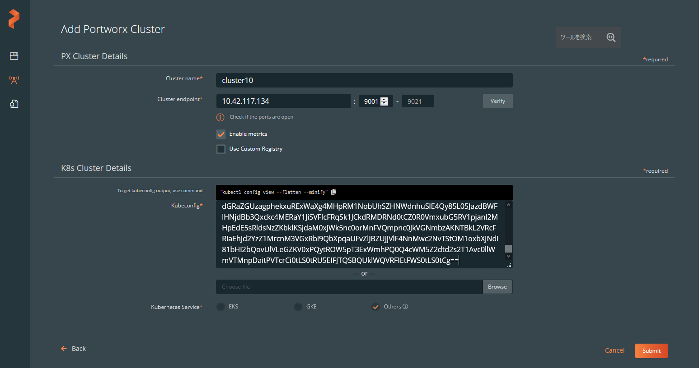  

- ステータスが確認できれば完了です。  
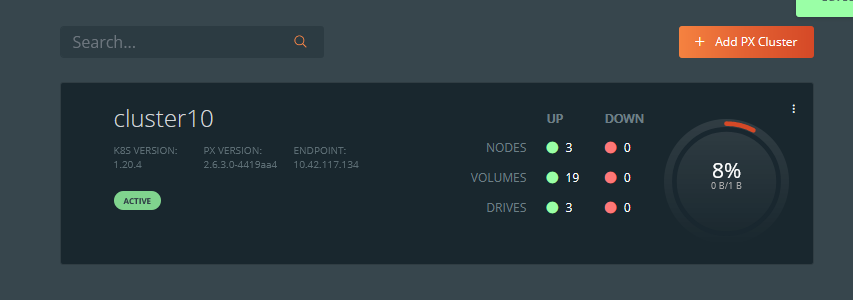  

### PX-BackupにKubernetes Clusterを登録  

- *Backups*のUI上から *Add Cluster*を選択します。  
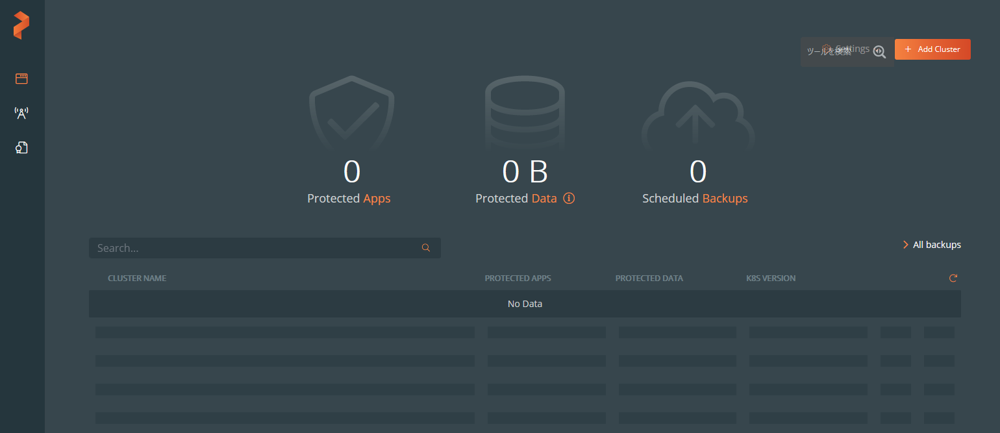  

- *Cluster name*を指定して、*kubeconfig*を入力し、*Submit*します。  
  - `kubectl config view --flatten --minify`で Kubeconfigの内容を確認できます。  
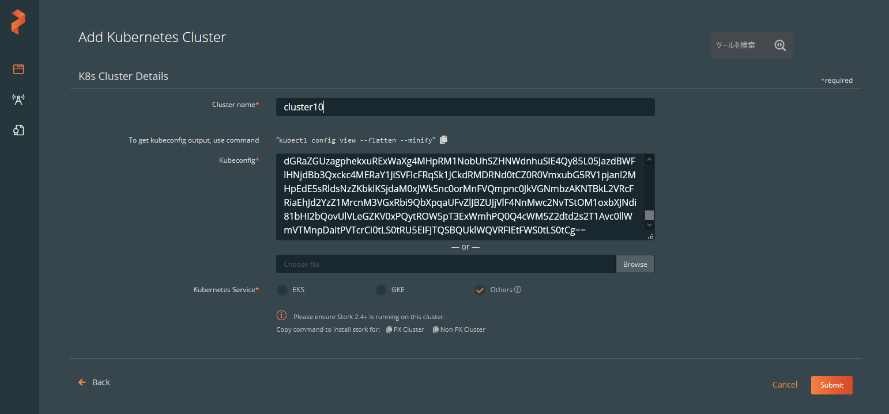  

- 登録されていることを確認します。  
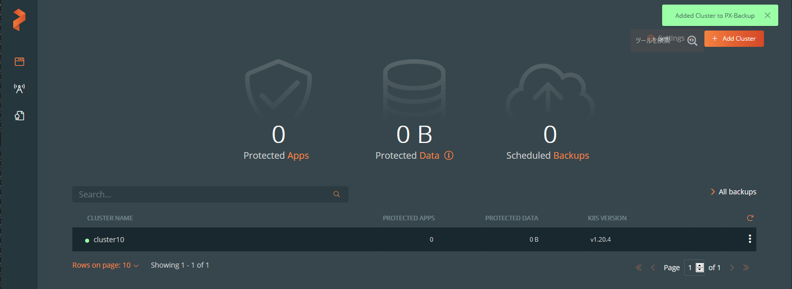  


以上
 


